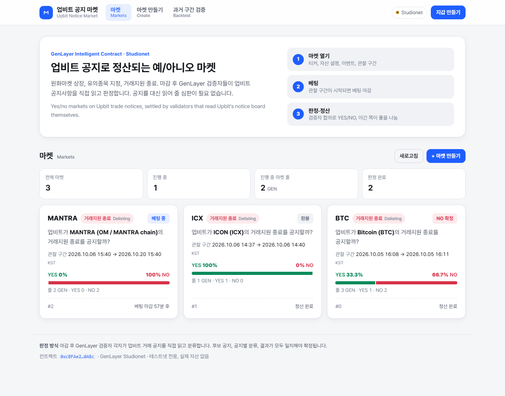

# 업비트 공지 마켓 · Upbit Notice Market (web app)

The web frontend for the [`UpbitNoticeMarket`](contract/upbit_notice_market.py) Intelligent Contract.

**Live app:** https://zldqms6.github.io/upbit-notice-market/  
**Contract repo** (tests, live validator demo, design notes): https://github.com/zldqms6/upbit-notice-market  
`contract/` here is a copy of the deployed source for reference.



It's a yes/no prediction market on Upbit trade notices: KRW listings, new caution designations and delistings. After the window closes, GenLayer validators read Upbit's notice board, classify every candidate notice, and must agree before the market settles. The UI is in Korean first, with short English subtitles, because the users are Korean traders.

Live contract on Studionet: `0xcBFAe21737493E5ce5cA22686D5D2AECA4140A8c`

## What you can do

| Screen | Contract calls |
|---|---|
| **마켓 Markets**: every market with symbol, event, asset, observation window (KST), pools, status and implied odds (`yes_pool / total`) | `get_market_count`, `get_market` |
| **마켓 상세 Market detail**: bet YES/NO with an estimated payout, resolve after the deadline, redeem, void after 21 days, your stake, and the evidence table (notice id and link, Korean title, `same_asset`, classification) | `bet` (payable), `resolve`, `redeem`, `void`, `get_stake`, `get_market` |
| **마켓 만들기 Create**: symbol, asset ("name + network"), event with plain-language rules, betting close and deadline in KST. Validation mirrors the contract: close in the future, deadline after close, window ≤ 60 days | `create_market` |
| **과거 구간 검증 Backtest**: run the real resolution on a past window before opening a market. Prefilled with five real cases (POD KRW listing → YES, same ticker on Solana → NO, MANTRA caution *extension* → NO, BLAST → YES, ICX delisting → YES) | `preview`, `get_preview` |

Transaction UX:
- One transaction runs at a time, in a dock that stays put when you change screens.
- The dock shows the phase, an elapsed timer, and the tx hash with a link to the Studionet explorer.
- When a tx is ACCEPTED, the app checks the leader's `execution_result`. On Studionet a rate-limited LLM call (`LLM_RATE_LIMITED`) or a contract `UserError` still reaches ACCEPTED, because validators agree that it failed, but nothing changes on chain. The app says so plainly and shows a retry button.
- After a tx succeeds, the screen reads the contract again with `transactionHashVariant: "latest-nonfinal"`. That way you see the accepted state without waiting for the appeal window to close.

## Wallet: testnet burner only

- The app makes a private key in the browser (`generatePrivateKey` / `createAccount` from genlayer-js) and keeps it in `localStorage`.
- **Fund 100 test GEN** calls Studionet's `sim_fundAccount` JSON-RPC straight from the browser. `studio.genlayer.com/api` sends back the request's origin in `Access-Control-Allow-Origin`, so this works from GitHub Pages and from localhost.
- If the call fails, the app shows the equivalent `curl` command:

```bash
curl -X POST https://studio.genlayer.com/api -H "Content-Type: application/json" \
  -d '{"jsonrpc":"2.0","id":1,"method":"sim_fundAccount","params":["<your address>",100000000000000000000]}'
```

- Under 고급 (advanced) you can export the private key or delete the wallet.

## Run locally

Requires Node 18+.

```bash
cd app
npm i
npm run dev        # http://localhost:5173
```

## Build

```bash
npm run build      # type-checks (tsc) and writes app/dist/
npm run preview    # serves dist/ at http://localhost:4173
```

`vite.config.ts` sets `base: "./"`, so every asset path in `dist/` is relative. Routing is hash-based (`#/market/3`), which means the same build works at `/`, at `/upbit-notice-market/`, or under any other subpath, with no server rewrites.

## Deploy to GitHub Pages

Pick one of these.

**A. `gh-pages` branch (keeps build output out of `main`)**

```bash
cd app
npm ci && npm run build
cd dist
git init -b gh-pages
git add -A
git commit -m "deploy"
git remote add origin https://github.com/<user>/<repo>.git
git push -f origin gh-pages
```

Then in the repo go to Settings → Pages, choose Source "Deploy from a branch", and select branch `gh-pages`, folder `/ (root)`.
The site is served at `https://<user>.github.io/<repo>/`.

**B. `docs/` folder on `main`**

```bash
cd app
npm ci && npm run build
rm -rf ../../docs && cp -r dist ../../docs     # docs/ at the repo root
touch ../../docs/.nojekyll
git add ../../docs && git commit -m "deploy app" && git push
```

Then go to Settings → Pages, choose "Deploy from a branch", and select branch `main`, folder `/docs`.

Either way, nothing in the build depends on the repo name.

## Files

```
app/
  index.html          shell, loads Pretendard (Korean UI font) from jsDelivr
  vite.config.ts      base "./" for subpath hosting
  src/chain.ts        genlayer-js client, burner wallet, faucet, reads, write+wait with leader-error check
  src/main.ts         router and the four screens, tx dock, wallet sheet
  src/format.ts       KST time helpers, GEN formatting, Korean event labels and rules
  src/examples.ts     the five real preview cases from ../demo_result.json
  src/style.css       light/dark (prefers-color-scheme), responsive down to 360px
  screenshots/        desktop and mobile captures from a live run on Studionet
```

The only runtime dependency is `genlayer-js`. There's no UI framework.

## Limitations

- **Testnet only.** The burner key is stored unencrypted in `localStorage`. Anyone with access to this browser profile can use it. Studionet GEN has no value. There's no MetaMask flow.
- **Studionet's shared LLM gets rate-limited.** `preview` and `resolve` call an LLM whenever there are candidate notices, and these can fail with `LLM_RATE_LIMITED`. The app detects this and offers a retry. Wait a minute or two before retrying.
- **Speed.** `preview` and `resolve` need full validator consensus, which takes anywhere from tens of seconds to about 3 minutes (the live preview below took 14 s). Other writes take about 10 to 40 seconds.
- **Reads use `latest-nonfinal`,** which is the state consensus accepted. It could still change on appeal.
- **Upbit's notice API is public but undocumented.** It also only reaches back about two months, so resolve a market within a few weeks of its deadline. See the contract README for details.
- The markets list loads the newest 12 markets, with "더 보기" for older ones. Studionet limits each IP to about 30 RPC calls per minute.
